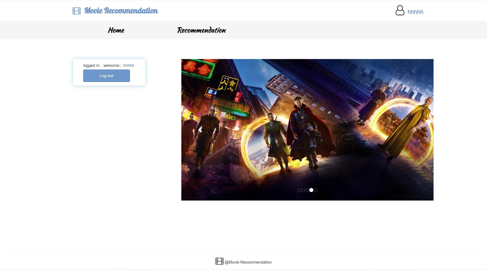
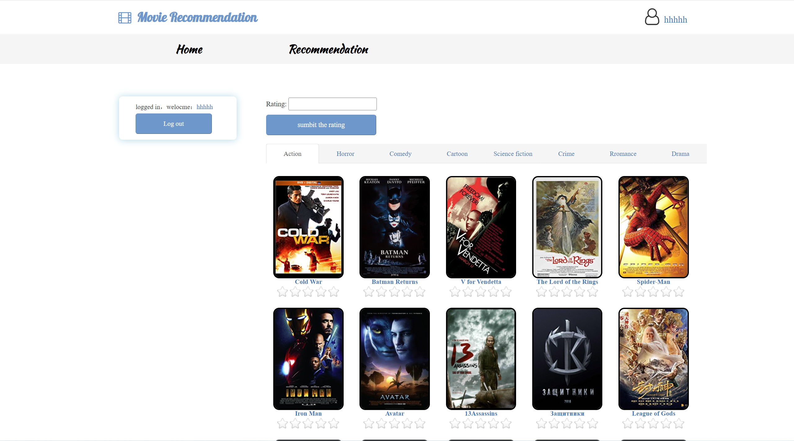
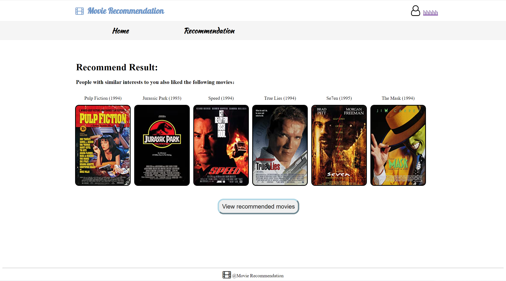
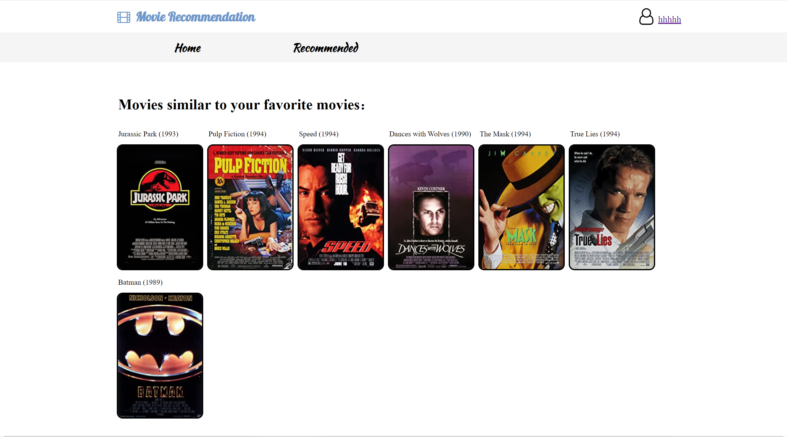

### <<<<<<<<<<<<<<<<<<<< Start of Template >>>>>>>>>>>>>>>>>>>>

---

## SECTION 1 : PROJECT TITLE
## IRS-PM-2022-10-30-IS04PT-GRP-Movie Recommendation System

---

## SECTION 2 : EXECUTIVE SUMMARY / PAPER ABSTRACT
Nowadays movies have become one of the most popular and crucial entertainment mediums in people’s daily life. Also as a popular culture and art in contemporary society, the penetration, inclusiveness and coverage of movie and television art are unmatched by other arts. It affects social life by acting on people's thoughts and concepts. Movie and television appreciation can improve the aesthetic taste and artistic appreciation ability of people all around the world, and plays an important role in the quality education of people.

With the rapid development of Internet and technology, more and more companies tend to build an online movie website by purchasing movies’ copyright and provide users with paid online viewing services like Netflix, Prime Video, HBO Max, Tencent Video, etc. And every platform has its own recommendation system, which is very significant:

First, a fast recommendation system can increase user growth, increase user retention, activity, and length of stay on the web pages.

Most video streaming platforms use the membership-based profit model, Therefore, it is very important to increase the conversion rate of VIP and VIP retention. An accurate recommendation system can increase the purchase rate of VIP and attract users to continue watching movies that match their preferences.

A complete recommendation system can help save labor costs for companies. We can imagine that, with the increase of business complexity, the cost of the algorithm is basically constant, while the editing cost increases linearly. Therefore, the recommendation algorithm is widely used in extremely complex products or video companies with multiple product matrices to maintain, which can greatly reduce the Labor costs.

Using the techniques imparted to us in lectures, Our group use MySQL for building the whole database and deploy Django to build interfaces, and use python post method to resolve user preference data sent back by the frontend(Jquery+CSS3+HTML5). The collaborative filtering algorithm written by Python will give a feedback recommendation result back to the frontend.

---

## SECTION 3 : CREDITS / PROJECT CONTRIBUTION

| Official Full Name  | Student ID (MTech Applicable)  | Work Items (Who Did What) | Email (Optional) |
| :------------ |:---------------:| :-----| :-----|
| Li Yuheng | A0261798L | 1. System architecture design 2. Data Acquisition 3. Data Processing 4. Django & Database development 5. User Interface development 6. Project report writing| e0983192@nus.edu.sg |
| Huang Chenxi | A0261955W | xxxxxxxxxx yyyyyyyyyy zzzzzzzzzz| A1234567B@gmail.com |
| Guo Hongxi | A0261887M | xxxxxxxxxx yyyyyyyyyy zzzzzzzzzz| A1234567C@outlook.com |
| Paulson Premsingh Samson Dhansingh | A0261986M | xxxxxxxxxx yyyyyyyyyy zzzzzzzzzz| A1234567D@yahoo.com |

---

## SECTION 4 : VIDEO OF SYSTEM MODELLING & USE CASE DEMO

---

## SECTION 5 : USER GUIDE

`Refer to appendix <Installation & User Guide> in project report at Github Folder: ProjectReport`

### [ 1 ] To run the system using iss-vm

> download pre-built virtual machine from http://bit.ly/iss-vm

> start iss-vm

> open terminal in iss-vm

> $ git clone https://github.com/telescopeuser/Workshop-Project-Submission-Template.git

> $ source activate iss-env-py2

> (iss-env-py2) $ cd Workshop-Project-Submission-Template/SystemCode/clips

> (iss-env-py2) $ python app.py

> **Go to URL using web browser** http://0.0.0.0:5000 or http://127.0.0.1:5000

### [ 2 ] To run the system in other/local machine:
### Install additional necessary libraries. This application works in python 2 only.

> $ sudo apt-get install python-clips clips build-essential libssl-dev libffi-dev python-dev python-pip

> $ pip install pyclips flask flask-socketio eventlet simplejson pandas

---
## SECTION 6 : PROJECT REPORT / PAPER

`Refer to project report at Github Folder: ProjectReport`

**Recommended Sections for Project Report / Paper:**
- Executive Summary 
- Project Description
    - Project Objective
- Knowledge Modeling
  - Reasoning From Data
  - A Modeling Dataset
  - Knowledge Reasoning
- Solution
  - System Architecture
  - System Scope
  - System Features
- Future Improvements
- Conclusion
- Appendices
  - Project Proposal
  - Mapped System Functionalities against the knowledge, techniques and skills of modular courses
  - Installation and User Guide
  - Individual Project Report

---
## SECTION 7 : MISCELLANEOUS

`Refer to Github Folder: Miscellaneous`

### MovieGenre3.csv

### users_resulttable.csv
* Results of survey
* Insights derived, which were subsequently used in our system

---

### <<<<<<<<<<<<<<<<<<<< End of Template >>>>>>>>>>>>>>>>>>>>

---

**This [Machine Reasoning (MR)](https://www.iss.nus.edu.sg/executive-education/course/detail/machine-reasoning "Machine Reasoning") course is part of the Analytics and Intelligent Systems and Graduate Certificate in [Intelligent Reasoning Systems (IRS)](https://www.iss.nus.edu.sg/stackable-certificate-programmes/intelligent-systems "Intelligent Reasoning Systems") series offered by [NUS-ISS](https://www.iss.nus.edu.sg "Institute of Systems Science, National University of Singapore").**

**Lecturer: [GU Zhan (Sam)](https://www.iss.nus.edu.sg/about-us/staff/detail/201/GU%20Zhan "GU Zhan (Sam)")**

**zhan.gu@nus.edu.sg**
